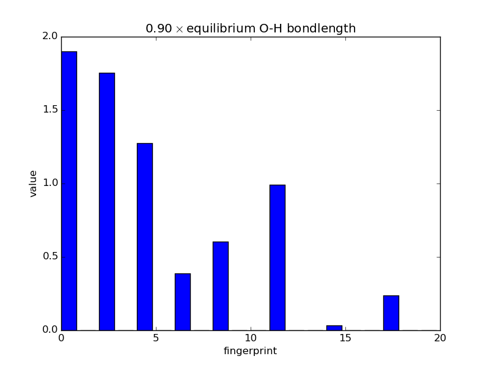

.. _ExampleScripts:

==================================
Example scripts
==================================

----------------------------------
A basic fitting script
----------------------------------

The below script uses Gaussian descriptors with a neural network backend --- the Behler-Parrinello approach --- to train energies only to a training set made by the script. Note that most of the code is just generating the training data, and the training takes place in a couple of lines.

.. code-block:: python

 """Simple test of the Amp calculator, using Gaussian descriptors and neural
 network model. Randomly generates data with the EMT potential in MD
 simulations."""

 import os
 from ase import Atoms, Atom, units
 import ase.io
 from ase.calculators.emt import EMT
 from ase.build import fcc110
 from ase.md.velocitydistribution import MaxwellBoltzmannDistribution
 from ase.md import VelocityVerlet
 from ase.constraints import FixAtoms
 
 from amp import Amp
 from amp.descriptor.gaussian import Gaussian
 from amp.model.neuralnetwork import NeuralNetwork
 
 
 def generate_data(count, filename='training.traj'):
     """Generates test or training data with a simple MD simulation."""
     if os.path.exists(filename):
         return
     traj = ase.io.Trajectory(filename, 'w')
     atoms = fcc110('Pt', (2, 2, 2), vacuum=7.)
     atoms.extend(Atoms([Atom('Cu', atoms[7].position + (0., 0., 2.5)),
                         Atom('Cu', atoms[7].position + (0., 0., 5.))]))
     atoms.set_constraint(FixAtoms(indices=[0, 2]))
     atoms.calc = EMT()
     atoms.get_potential_energy()
     traj.write(atoms)
     MaxwellBoltzmannDistribution(atoms, 300. * units.kB)
     dyn = VelocityVerlet(atoms, dt=1. * units.fs)
     for step in range(count - 1):
         dyn.run(50)
         traj.write(atoms)
 
 
 generate_data(20)
 
 calc = Amp(descriptor=Gaussian(),
            model=NeuralNetwork(hiddenlayers=(10, 10, 10)))
 calc.train(images='training.traj')

 
Note you can monitor the progress of the training by typing `amp-plotconvergence amp-log.txt`, which will create a file called `convergence.pdf`.

----------------------------------
A basic script with forces
----------------------------------

The below script trains both energy and forces to the same training set as above. Note this may take some time to run, which will depend upon the initial guess for the neural network parameters that is randomly generated. Try decreasing the `force_rmse` convergence parameter if you would like faster results.

.. code-block:: python

 """Simple test of the Amp calculator, using Gaussian descriptors and neural
 network model. Randomly generates data with the EMT potential in MD
 simulations."""

 import os
 from ase import Atoms, Atom, units
 import ase.io
 from ase.calculators.emt import EMT
 from ase.build import fcc110
 from ase.md.velocitydistribution import MaxwellBoltzmannDistribution
 from ase.md import VelocityVerlet
 from ase.constraints import FixAtoms
 
 from amp import Amp
 from amp.descriptor.gaussian import Gaussian
 from amp.model.neuralnetwork import NeuralNetwork
 from amp.model import LossFunction
 
 
 def generate_data(count, filename='training.traj'):
     """Generates test or training data with a simple MD simulation."""
     if os.path.exists(filename):
         return
     traj = ase.io.Trajectory(filename, 'w')
     atoms = fcc110('Pt', (2, 2, 2), vacuum=7.)
     atoms.extend(Atoms([Atom('Cu', atoms[7].position + (0., 0., 2.5)),
                         Atom('Cu', atoms[7].position + (0., 0., 5.))]))
     atoms.set_constraint(FixAtoms(indices=[0, 2]))
     atoms.calc = EMT()
     atoms.get_potential_energy()
     traj.write(atoms)
     MaxwellBoltzmannDistribution(atoms, 300. * units.kB)
     dyn = VelocityVerlet(atoms, dt=1. * units.fs)
     for step in range(count - 1):
         dyn.run(50)
         traj.write(atoms)
 
 
 generate_data(20)
 
 calc = Amp(descriptor=Gaussian(),
            model=NeuralNetwork(hiddenlayers=(10, 10, 10)))
 calc.model.lossfunction = LossFunction(convergence={'energy_rmse': 0.02,
                                                     'force_rmse': 0.02})
 calc.train(images='training.traj')

 
Note you can monitor the progress of the training by typing `amp-plotconvergence amp-log.txt`, which will create a file called `convergence.pdf`.

----------------------------------
Examining fingerprints
----------------------------------

With the modular nature, it's straightforward to analyze how fingerprints change with changes in images.
The below script makes an animated GIF that shows how a fingerprint about the O atom in water changes as one of the O-H bonds is stretched.
Note that most of the lines of code below are either making the atoms or making the figure; very little effort is needed to produce the fingerprints themselves---this is done in three lines.

.. code-block:: python

 # Make a series of images.
 import numpy as np
 from ase.structure import molecule
 from ase import Atoms
 atoms = molecule('H2O')
 atoms.rotate('y', -np.pi/2.)
 atoms.set_pbc(False)
 displacements = np.linspace(0.9, 8.0, 20)
 vec = atoms[2].position - atoms[0].position
 images = []
 for displacement in displacements:
     atoms = Atoms(atoms)
     atoms[2].position = (atoms[0].position + vec * displacement)
     images.append(atoms)
 
 # Fingerprint using Amp.
 from amp.descriptor.gaussian import Gaussian
 descriptor = Gaussian()
 from amp.utilities import hash_images
 images = hash_images(images, ordered=True)
 descriptor.calculate_fingerprints(images)
 
 # Plot the data.
 from matplotlib import pyplot
 
 def barplot(hash, name, title):
     """Makes a barplot of the fingerprint about the O atom."""
     fp = descriptor.fingerprints[hash][0]
     fig, ax = pyplot.subplots()
     ax.bar(range(len(fp[1])), fp[1])
     ax.set_title(title)
     ax.set_ylim(0., 2.)
     ax.set_xlabel('fingerprint')
     ax.set_ylabel('value')
     fig.savefig(name)
 
 for index, hash in enumerate(images.keys()):
     barplot(hash, 'bplot-%02i.png' % index,
             '%.2f$\\times$ equilibrium O-H bondlength'
             % displacements[index])
 
 # For fun, make an animated gif.
 import os
 filenames = ['bplot-%02i.png' % index for index in range(len(images))]
 command = ('convert -delay 100 %s -loop 0 animation.gif' %
            ' '.join(filenames))
 os.system(command)

