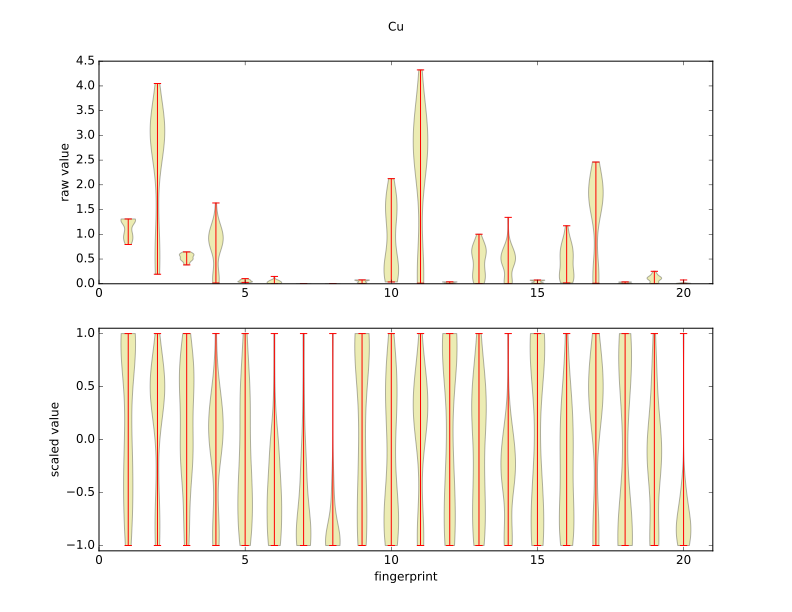

.. _MoreDescriptor:

==================================
More on descriptors
==================================

----------------------------------
Fingerprint ranges
----------------------------------

It is often useful to examine your fingerprints more closely. There is a utility that can help with that, an example of its use is below. This assumes you have open a calculator called "calc.amp" and you want to examine the fingerprint ranges for your training data.

.. code-block:: python

 from ase import io
 from amp.descriptor.analysis import FingerprintPlot
 from amp import Amp
 
 calc = Amp.load('calc.amp')
 images = io.read('training.traj', index=':')
 
 fpplot = FingerprintPlot(calc)
 fpplot(images)

This will create a plot that looks something like below, here showing the fingerprint ranges for the specified element. 

You can also overlay a specific image's fingerprint on to the fingerprint plot by using the `overlay` keyword when calling fpplot.
