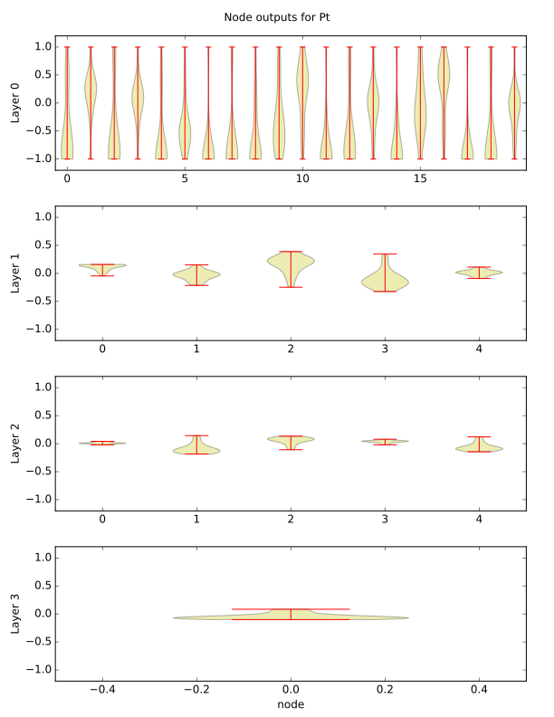

.. _MoreModel:

==================================
More on models
==================================

Visualizing neural network outputs
----------------------------------

It can be useful to visualize the neural network model to see how it is behaving. For example, you may find nodes that are effectively shut off (e.g., always giving a constant value like 1) or that are acting as a binary switch (e.g., only returning 1 or -1). There is a tool to allow you to visualize the node outputs of a set of data.

.. code-block:: python

    from amp.model.neuralnetwork import NodePlot

    nodeplot = NodePlot(calc)
    nodeplot.plot(images, filename='nodeplottest.pdf')

This will create a plot that looks something like below. Note that one such series of plots is made for each element. Here, Layer 0 is the input layer, from the fingerprints. Layer 1 and Layer 2 are the hidden layers. Layer 3 is the output layer; that is, the contribution of Pt to the potential energy (before it is multiplied by and added to a parameter to bring it to the correct magnitude).

Calling an observer during training
-----------------------------------
It can be useful to call a function known as an "observer" during the training of the model. In the neural network implementation, this can be accomplished by attaching an observer directly to the model. The observer is executed at each call to `model.get_loss`, and is fed the arguments (self, vector, loss). An example of using the observer to print out one component of the parameter vector is shown below:

.. code-block:: python

    def observer(model, vector, loss):
        """Prints out the first component of the parameter vector."""
        print(vector[0])

    calc.model.observer = observer
    calc.train(images)

With this approach, all kinds of fancy tricks are possible, like calling *another* Amp model that reports the loss function on a test set of images. This could be useful to implement training with early stopping, for example.
