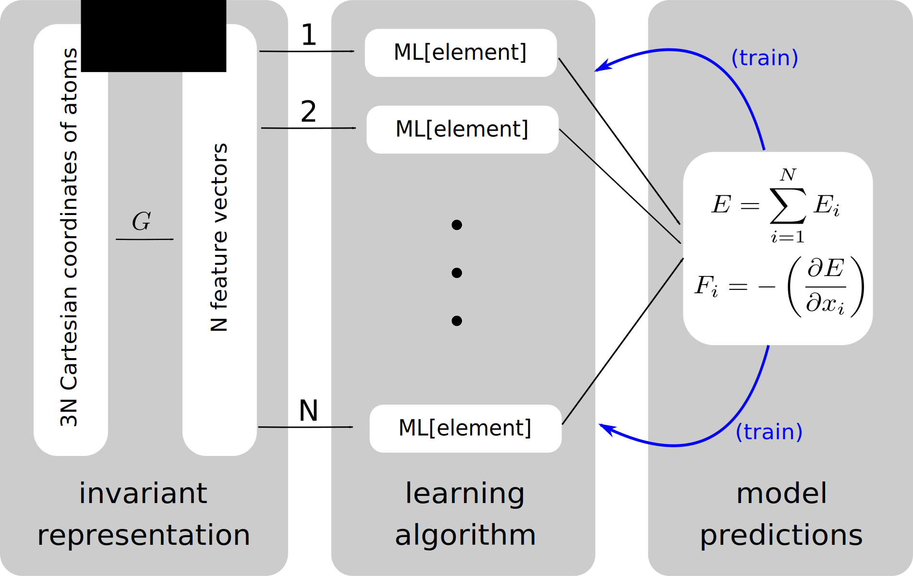
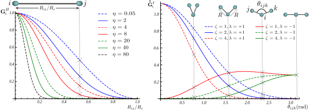
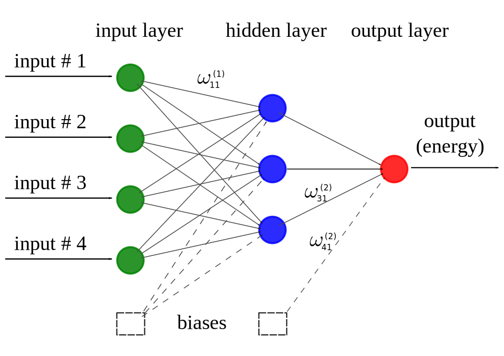

.. _theory:

==================================
Theory
==================================

According to the Born-Oppenheimer approximation, the ground-state potential energy of an atomic configuration is dictated solely by the nuclear coordinates (under certain conditions, such as the absence of external fields and constant charge).
The potential energy is in general a very complicated function of the nuclear coordinates; it in theory can be calculated by directly solving the Schrodinger equation.
However, in practice, an exact analytical solution to the many-body Schrodinger equation is very difficult (if not impossible), and most electronic structure codes provide a point-by-point approximation to the ground-state potential energy for given nuclear configurations.

Given enough example calculations from any electronic structure calculator, the idea is then to approximate the potential energy with a regression model:

.. math::
  \textbf{R}\xrightarrow{\text{regression}}E=E(\textbf{R}),

where :math:`\textbf{R}` is the position of atoms in the system.

-----------------------------------------
Atomic representation of potential energy
-----------------------------------------

In order to have a potential function which is simultaneously applicable to systems of
different sizes, the total potential energy of the system can to be broken up into atomic
energy contributions:

.. math::
  E(\textbf{R})=\sum_{\text{atom}=1}^{N}E_\text{atom}(\textbf{R}).

The above expansion can be justified by assembling the atomic configuration by bringing
atoms close to each other one by one. Then the atomic energy contributions (instead of the energy of the whole system at once) can be
approximated using a regression method:

.. math::
  \textbf{R}\xrightarrow{\text{regression}}E_\text{atom}=E_\text{atom}\left(\textbf{R}\right).

----------
Descriptor
----------

A better interpolation can be achieved if an appropriate symmetry function :math:`\textbf{G}`
of atomic coordinates, approximating the functional dependence of local energetics, is used
as the input of the regression operator:

.. math::
  \textbf{R}\xrightarrow{\textbf{G}}\textbf{G}\left(\textbf{R}\right)\xrightarrow{\text{regression}}E_\text{atom}=E_\text{atom}\left(\textbf{G}\left(\textbf{R}\right)\right).

In net, this results in a scheme like shown below. The symmetry functions create "feature vectors" which in turn are fed into a machine-learning regression model.

********
Gaussian
********

A Gaussian descriptor :math:`\textbf{G}` as a function of pair-atom distances and three-atom angles has been suggested by Behler [1], and is implemented within Amp.
Radial fingerprints of the Gaussian type capture the interaction of atom :math:`i` with all atoms :math:`j` as the sum of Gaussians with width :math:`\eta` and center (offset) :math:`R_s`,

.. math::
  G_{i}^\mathrm{II}=\sum^{\tiny{\begin{array}{c} \text{atoms j within }R_c\\
  \text{ distance of atom i}
  \end{array}}}_{j\ne i}{e^{-\eta(R_{ij}-R_s)^2/R_c^2}f_c\left(R_{ij}\right)}.

By specifying many values of :math:`\eta` and :math:`R_s` we can begin to build a feature vector for regression.

The next type is the angular fingerprint accounting for three-atom interactions.
The Gaussian angular fingerprints are computed for all triplets of atoms :math:`i`, :math:`j`, and :math:`k` by summing over the cosine values of the angles :math:`\theta_{ijk}=\cos^{-1}\left(\displaystyle\frac{\textbf{R}_{ij}.\textbf{R}_{ik}}{R_{ij}R_{ik}}\right)`, (:math:`\textbf{R}_{ij}=\textbf{R}_{i}-\textbf{R}_{j}`), centered at atom :math:`i`, according to

.. math::
  G_{i}^\mathrm{IV}=2^{1-\zeta}\sum^{\tiny{\begin{array}{c} \text{atoms j, k within }R_c\\
  \text{ distance of atom i}
  \end{array}}}_{\scriptsize\begin{array}{c}
  j,\,k\ne i \\
  (j\ne k) \end{array}}{\left(1+\lambda \cos \theta_{ijk}\right)^\zeta
  e^{-\eta\left(R_{ij}^2+R_{ik}^2+R_{jk}^2\right)/R_c^2}f_c\left(R_{ij}\right)f_c\left(R_{ik}\right)f_c\left(R_{jk}\right)},

with parameters :math:`\lambda`, :math:`\eta`, and :math:`\zeta`, which again can be chosen to build more elements of a feature vector.

There is an alternative angular symmetry function that ignores the separation between atoms :math:`j` and :math:`k`; this can be better behaved than the previous function.

.. math::
  G_{i}^\mathrm{V}=2^{1-\zeta}\sum^{\tiny{\begin{array}{c} \text{atoms j, k within }R_c\\
  \text{ distance of atom i}
  \end{array}}}_{\scriptsize\begin{array}{c}
  j,\,k\ne i \\
  (j\ne k) \end{array}}{\left(1+\lambda \cos \theta_{ijk}\right)^\zeta
  e^{-\eta\left(R_{ij}^2+R_{ik}^2\right)/R_c^2}f_c\left(R_{ij}\right)f_c\left(R_{ik}\right)},

The cutoff function :math:`f_c\left(R_{ij}\right)` in the above equations defines the energetically relevant local environment with value one at :math:`R_{ij}=0` and zero at :math:`R_{ij}=R_{c}`, where :math:`R_c` is the cutoff radius.
In order to have a continuous force-field, the cutoff function :math:`f_c\left(R_{ij}\right)` as well as its first derivative should be continuous in :math:`R_{ij}\in\left[0,\infty\right)`. One possible expression for such a function as proposed by Behler [1] is

.. math::
    f_{c}\left(r\right)==
    \begin{cases}
    &0.5\left(1+\cos\left(\pi\displaystyle\frac{r}{R_c}\right)\right)\qquad \text{for}\;\: r\leq R_{c},\\
    &0\qquad\qquad\qquad\qquad\quad\quad\quad\:\: \text{for}\;\: r> R_{c}.\\
    \end{cases}

Another more general choice for the cutoff function is the following polynomial [5]:

.. math::
    f_{c} \left( r \right)=
    \begin{cases}
                1 + \gamma \cdot \left(r/R_c\right)^{\gamma + 1} - (\gamma + 1) \left(r/R_c\right)^{\gamma}\qquad\quad &\text{if}\;\: r\leq R_{c},\\
     0&\text{if}\;\: r> R_{c},\\
    \end{cases}

with a user-specified parameter :math:`\gamma` that determines the rate of decay of the cutoff function as it extends from :math:`r=0` to :math:`r=R_c`.

The figure below shows how components of the fingerprints :math:`\textbf{G}^\mathrm{II}` and :math:`\textbf{G}^\mathrm{IV}` change with, respectively, distance :math:`R_{ij}` between the pair of atoms :math:`i` and :math:`j` and the valence angle :math:`\theta_{ijk}` between the triplet of atoms :math:`i`, :math:`j`, and :math:`k` with central atom :math:`i`:

*******
Zernike
*******

A three-dimensional Zernike descriptor is also available inside Amp, and can be used as the atomic environment descriptor.
The Zernike-type descriptor has been previously used in the machine-learning community extensively, but it has been suggested here for the first time for representing the local chemical environment.
Zernike moments are basically a tensor product between spherical harmonics (complete and orthogonal on the surface of the unit sphere), and Zernike polynomials (complete and orthogonal within the unit sphere).
Zernike descriptor components for each integer degree are then defined as the norm of Zernike moments with the same corresponding degree.
For more details on the Zernike descriptor the reader is referred to the nice paper of Novotni and Klein [2].

Inspired by Bartok et. al. [3], to represent the local chemical environment of atom :math:`i`, an atomic density function :math:`\rho_{i}(\mathbf{r})` is defined for each atomic local environment as the sum of delta distributions shifted to atomic positions:

.. math::
    \rho_{i}(\mathbf{r}) = \sum_{j\neq
    i}^{\tiny{\begin{array}{c} \text{atoms j within }R_c\\
    \text{ distance of atom i}
    \end{array}}}\eta_{j}\delta\left(\mathbf{r}-\mathbf{R}_{ij}\right)f_{c}\left(\|\mathbf{R}_{ij}\|\right),

Next, components of the Zernike descriptor are computed from Zernike moments of the above atomic density destribution for each atom :math:`i`.

The figure below shows how components of the Zernike descriptor vary with pair-atom distance, three-atom angle, and four-atom dehidral angle.
It is important to note that components of the Gaussian descriptor discussed above are non-sensitive to the four-atom dehidral angle of the following figure.

.. image:: _static/zernike.svg
   :width: 1200 px
   :align: center

**********
Bispectrum
**********

Bispectrum of four-dimensional spherical harmonics have been suggested by Bartok et al. [3] to be invariant under rotation of the local atomic environment.
In this approach, the atomic density distribution defined above is first mapped onto the surface of unit sphere in four dimensions.
Consequently, Bartok et al.  have shown that the bispectrum of this mapping can be used as atomic environment descriptor.
We refer the reader to the original paper [3] for mathematical details.
This approach of describing local environment is also available inside Amp.

----------------
Regression Model
----------------

The general purpose of the regression model :math:`x\xrightarrow{\text{regression}}y` with input :math:`x` and output :math:`y` is to approximate the function :math:`y=f(x)` by using sample training data points :math:`(x_i, y_i)`.
The intent is to later use the approximated :math:`f` for input data :math:`x_j` (other than :math:`x_i` in the training data set), and make predictions for :math:`y_j`.
Typical regression models include Gaussian processes, support vector regression, and neural network.

********************
Neural network model
********************

A neural network model is basically a very simple model of how the nervous system processes information.
The first mathematical model was developed in 1943 by McCulloch and Pitts [4] for classification purposes; biological neurons either send or do not send a signal to the neighboring neuron.
The model was soon extended to do linear and nonlinear regression, by replacing the binary activation function with a continuous function.
The basic functional unit of a neural network is called "node".
A number of parallel nodes constitute a layer.
A feed-forward neural network consists of at least an input layer plus an output layer.
When approximating the PES, the output layer has just one neuron representing the potential energy.
For a more robust interpolation, a number of "hidden layers" may exist in the neural network as well; the word "hidden" refers to the fact that these layers have no physical meaning.
A schematic of a typical feed-forward neural network is shown below.
In each node a number of inputs is multiplied by the corresponding weights and summed up with a constant bias.
An activation function then acts upon the summation and an output is generated.
The output is finally sent to the neighboring neuron in the next layer.
Typically used activation functions are hyperbolic tangent, sigmoid, Gaussian, and linear functions.
The unbounded linear activation function is particularly useful in the last hidden layer to scale neural network outputs to the range of reference values.
For our purpose, the output of neural network represents energy of atomic system.

**References:**

1. "Atom-centered symmetry functions for constructing high-dimensional neural network potentials", J. Behler, J. Chem. Phys. 134(7), 074106 (2011)

2. "Shape retrieval using 3D Zernike descriptors", M. Novotni and R. Klein, Computer-Aided Design 36(11), 1047--1062 (2004)

3. "Gaussian approximation potentials: The accuracy of quantum mechanics, without the electrons", A.P. Bart\'ok, M.C. Payne, R. Kondor and G. Csanyi, Physical Review Letters 104, 136403 (2010)

4. "A logical calculus of the ideas immanent in nervous activity", W.S. McCulloch, and W.H. Pitts, Bull. Math. Biophys. 5, 115--133 (1943)

5. "Amp: A modular approach to machine learning in atomistic simulations", A. Khorshidi, and A.A. Peterson, Comput. Phys. Commun. 207, 310--324 (2016)
